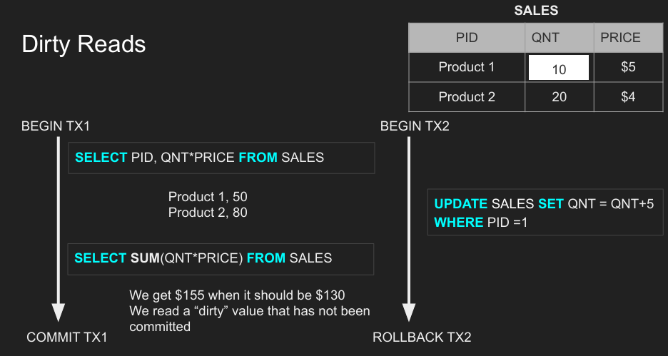

# 트랜잭션과 ACID

# 25.03.04

트랜잭션(Transaction)

- 쿼리들의 집합
- 하나의 작업 단위
- ex) Account deposit (SELECT, UPDATE, UPDATE)

트랜잭션 수명(Transaction Lifespan)

- Transaction BEGIN
- Transaction COMMIT
- Transaction ROLLBACK

원자성(Atomicity)

- 트랜잭션내의 모든 쿼리는 성공해야 한다.
- 동일한 트랜잭션의 쿼리들 중에서 하나라도 실패하면 이전의 성공했던 쿼리들은 모두 롤백 되어야 한다.
- 만약, 데이터베이스가 트랜잭션이 commit하기 전에 다운된다면 이전의 성공했던 쿼리들은 모두 롤백 되어야 한다.

---

# 25.03.29

고립성(Isolation) 

- 원격 연결을 지원한다면 데이터베이스에 많은 TCP 연결이 있어, 여러 트랜잭션이 동시에 동일한 데이터를 쓰거나 읽으려고 경합하는 동시성 발생 가능 ⇒ 고립성 필요
- 읽기 현상: DB에서 데이터를 읽으면서 발생할 수 있는 현상
    - `더티 읽기(dirty read)`: 다른 트랜잭션이 쓴 내용을 읽지만 실제로 아직 커밋되지 않은 것을 읽음 
    ⇒ 방금 읽은 변경 내용이 롤백 되거나 커밋될 수도 있고, DB 충돌이 일어날 수 있음
    dirty: 쓴 내용이 완전히 flush되지 않았거나 완전히 커밋되지 않았다는 것을 의미
        
        
        
    
    - `중복되지 않는 읽기(Non-reapeatable read)`: 트랜잭션 중에 값을 읽은 후, 동일한 트랜잭션에서 다시 그 값을 읽음 ⇒ 비효율적
    ex) 어떤 데이터를 조회하고, 다시 그 데이터를 가지고 SUM연산을 할 때 처음 읽었던 데이터의 값이 변경될 수 있음
        
        
        
    
    - `유령 읽기(Phantom read)`: 아직 존재하지 않아서 실제로 읽을 수 없는 것
    ex) 어떤 특정 날짜 사이의 모든 활동을 선택할 때, 새로운 행을 삽입하게 되면, 이후 다시 동일한 조건으로 조회하면 새로운 데이터가 나타남
        
        
        
    
    - `잃어버린 업데이트(Lost update)` : 어떤 데이터를 쓰고나서 커밋하기 전에 다른 트랜잭션에서 내가 다루고 있는 데이터에 접근해서 데이터를 변경, 그리고 다시 나의 트랜잭션이 반영되면 다른 트랜잭션이 업데이트한 내용이 사라짐
        
        
        

트랜잭션 고립수준

- Read uncommitted: 고립이 없음 ⇒ 내가 읽는 모든 것은 다른 이들이 변경하는 것들도 보임 ⇒ 커밋되지 않은 값들을 읽을 수 있음 ⇒ 더티 읽기 발생
- Read committed: 트랜잭션 내의 각 쿼리는 다른 트랜잭션에 의해 커밋된 변경 사항만을 볼 수 있음 ⇒ 다른 트랜잭션이 변경을 수행하는 동안, 해당 트랜잭션이 커밋되지 않는 이상 해당 변경을 볼 수 있음
- repeatable read: 읽기를 반복 가능하게 만듦 ⇒ 동일한 트랜잭션 내에서 한 번 읽고 다시 읽어도 값의 변경 X
- snapshot: 각 쿼리는 트랜잭션의 시작 시점까지 커밋된 변경 사항만을 볼 수 있음 ⇒ 그 순간 전체 데이터베이스의 스냅샷과 같음 ⇒ 모든 읽기 현상을 제거하는 것을 보장
- serializable: 물리적으로 각 트랜잭션이 데이터베이스에 연이어 직렬화 ⇒ 동일한 위치에 저장된 3개의 트랜잭션의 경우, 직렬화될 것

고립 수준과 읽기 현상 관계

데이터베이스 고립 수준 구현

- 각 DBMS는 고립 수준을 다르게 구현
- pessimistic(비관적): 비관적 동시성 제어 ⇒ 잠금(행 레벨 잠금, 테이블 잠금, 페이지 잠금)을 사용 ⇒ 비용이 매우 많이 발생
lock escalation(잠금 상승): 특정 트랜잭션이 전체 테이블을 잠그는 현상 ⇒ DB에 값을 반영하려는 트랜잭션은 모두 대기상태
- optimistic(낙관적): 잠금을 사용하지 않고, 상황에 맞게 처리하다가 트랜잭션이 충돌할 때 해당 트랜잭션을 실패시킴 ⇒ 대기 중인 트랜잭션 X, 잠금에 대한 비용 발생 X
⇒ 직렬화 오류: 사용자가 특정 트랜잭션을 시도할 때 트랜잭션 시작 시점에서 어떤 것이 변경되었으니 다시 시도하라는 의미로 실패 하는 것
- repeatable read(반복 가능한 읽기): snapshot으로 구현
- serializable: 적극적인 동시성 제어로 구현. 실제로 직렬화를 하면 DB 느려짐

---

# 25.04.21

일관성(Consistency) 

- 현재 유지되고 있는 데이터의 상태
    - 실제로 물리 공간에 저장된 데이터와 데이터 모델이 일치하는지 확인
- 일관된 읽기
- 일관성이 깨지는 예시
    - 하나의 계정에서 차변을 작성하는 도중에 데이터베이스가 다운되고 다시 시작했을 때 계정이 여전히 차변된 상태라면, 차변된 금액만큼 잃게되어버림
    - 인스타그램 사진 좋아요
        - 무결성이 있는 경우
            
            
            
        
        - 무결성이 깨지 경우
            
            
            
            - Pictures 테이블에서 1번 사진은 좋아요가 5개인데, Picture_Likes 테이블에서 1번 사진에 좋아요를 누른 사람은 2명이기 때문에 데이터의 일관성 깨짐
            - Pictures_Likes에서 Edmond가 4번이라는 사진에 좋아요를 눌렀는데, Pictures 테이블에서는 4번 사진이 없는 상태이기 때문에 데이터의 일관성 깨짐
    - 트랜잭션이 변경을 커밋했다면, 새로운 트랜잭션이 즉시 변경 사항을 볼 수 있는가?
        - 변경 사항을 커밋한 후에 즉시 읽기를 실행해서 변경 사항이 보이지 않으면 일관성이 없는 것
        - 주 데이터베이스와 이에 대한 복제본이 있을 때, 주 데이터베이스에서 변경 사항이 발생하면 주 데이터베이스는 복제본에 해당 사항을 동기화 ⇒ 동기화하는데 시간이 걸리므로 이 사이에 누군가 복제본의 데이터를 읽는 다면, 이전 버전의 데이터를 읽는 것이므로 일관성 깨짐
- 최종 일관성
    - 분산 시스템에서 나오는 개념으로, 데이터가 각 서버로 전파되는데 시간이 걸려 모든 서버가 동시에 데이터를 업데이트 하지 못하지만, 결국 시간이 지나면 모든 서버에 데이터가 전파되어 일관성을 갖추게됨

지속성

- 고객이 데이터베이스에 만든 권한을 비휘발성 시스템 저장소에 지속시키는 과정
- 변경사항을 지속하는 능력
- WAL(Write Ahead Log)
    - 모든 변경 사항을 먼저 기록 해두는 곳
    - 충돌이 발생하면 WAL 항목을 다시 읽어서 복구 할 수 있음
- 스냅샷
    - 모든 것을 메모리에 유지 후, 백그라운드에서 비동기적으로 한꺼번에 모든 것을 디스크에 저장
- AOF(Append Only File)
    - Redis가 데이터를 저장하는 방법
    - 모든 쓰기(write) 명령을 순서대로 파일에 기록하여, 서버를 재시작할 때 데이터를 복원하는 방식
- OS 캐시
    - 실제로 OS에 쓸 때 데이터베이스가 디스크에 쓰도록 윈도우나 리눅스같은 운영  체제에 요청하면, OS는 디스크에 쓰지 않고 자신의 메모리 캐시에 씀 ⇒ 디스크로 flush할 때 데이터를 일괄처리하기 위함 ⇒ I/O가 줄어들면 성능 향상
    - Fsync 명령
        - 만약, 데이터가 캐시에만 저장된 채로 컴퓨터가 다시 시작되면 캐시에 있던 데이터는 모두 날라감 ⇒ OS 캐시에 저장하지 않고, 디스크에 바로 강제로 flush할 수 있도록 하는 것이 Fsync 명령

---

# 25.04.22

Phantom Read

- 고립된 트랜잭션이 쿼리를 수행하는데 있어 다른 트랜잭션에서 새로운 행을 삽입했을 때, 고립된 트랜잭션은 다른 트랜잭션에서 추가한 새로운 행을 읽으면 안됨에도 불구하고 읽는 현상
- 예시
    - 판매 보고서 작성(판매한 물품들의 가격 합계 조회) 중에 누군가 물품을 추가로 판매하였다면 작성 중인 보고서의 판매 물품 합계값이 변해버림
- 해결 방법
    - 고립성 ⇒ 직렬화(msyql, oracle, postgres...), 반복가능한 읽기(postgres에서만 유령 읽기 해결)

Serializable vs Repeatable

- Repeatable로 고립 수준을 설정하면 위와 같이 t1, t2 트랜잭션의 수행 결과가 비정상적
    - t1과 t2를 각각 수행했을 때 aaaa 또는 bbbb의 결과가 나오길 원함
    - t1은 첫 번째 aa를 bb로 수정하고 t2는 두 번째 bb를 aa로 수정하기 때문에 서로 수정하는 부분이 겹치지 않아 동시성 문제 발생 X

- Serializable로 고립 수준을 설정하면 위와 같이 트랜잭션의 수행 결과가 정상적으로 수행
    - t1과 t2가 동시에 트랜잭션을 수행하고 있을 때, 두 트랜잭션 중 하나의 트랜잭션이 커밋되면 수행 중이던 다른 트랜잭션에서 커밋하는 것을 방지

---

# 25.04.23

테이블과 인덱스가 디스크에 어떻게 저장되는가

- 행 id: 데이터베이스는 사용자가 테이블에 설정한 id(key)값으로 동작하는 것이 아닌 자체적으로 유지되는 행을 만들어서 사용 ⇒ 위의 테이블에서는 row_id이며, postgres에서는 튜플 id라고도 함

- 페이지: 여러 개의 행을 저장 하고 있으며, 고정된 크기의 메모리 위치로, 디스크 위치로도 변환되는 일련의 바이트(한 페이지의 크기: postgres의 경우 기본 8kb, mysql의 경우 기본 16kb)
- 힙(Heap): 데이터 테이블을 가리키는 페이지의 모음
- 인덱스(Index): 힙에서 어떤 데이터를 찾을 때 어떤 부분의 힙을 읽어야 하는지 알 수 있게 해주는 숫자 포인터
    - B-Tree 사용
    - 인덱스에서 값을 찾으면, 힙으로 이동하여 데이터를 찾음
    - 인덱스도 페이지로 저장되며, 인덱스 항목을 가져오는 것도 IO 비용 발생
    - 클러스터 인덱스(Clustered Index): 인덱스에 따라 힙(실제 데이터가 있는 곳)의 데이터들이 자동으로 정렬 ⇒ 데이터들이 자동으로 정렬되어 검색은 빠르나, insert/update/delete 느림
    - 논클러스터 인덱스(Non-Clustered Index): 인덱스만 정렬되고 힙의 데이터들은 정렬되어 있지 않음 ⇒ 데이터들이 정렬되지 않아 검색은 느리나, 정렬할 필요가 없으므로 insert/update/delete는 빠름
- IO: 디스크로 읽는 요청 작업 ⇒ IO를 줄일 수록 쿼리를 빨라짐
    - IO는 디스크 파티션에 따라 한 페이지 이상을 가져올 수 있으며, 단일 행은 읽을 수 없음

행 기반 vs 열 기반 데이터베이스

데이터를 저장하는 기준이 행이냐 열이냐에 따라 나뉨

| 구분 | 행 기반(Row-Based) | 열 기반(Colomn-based) |
| --- | --- | --- |
| 읽기/쓰기 | 최적 | 느림 |
| 적합 시스템 | OLTP | OLAP |
| 압축 | 비효율적 | 효율적 |
| 집계 | 비효율적 | 효율적 |
| 쿼리 | 효율적 | 비효율 |
| DB 종류 | Oracle, MySQL, PostgreSQL 등 | Amazon Redshift, Google Bigquery, Teradata, Snowflake, Cassandra, HBase |
