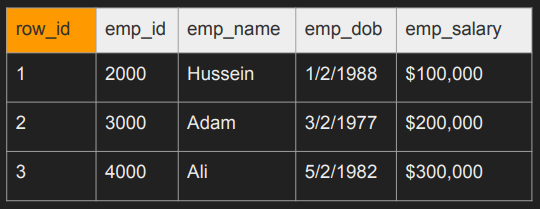

# 데이터베이스 내부 이해

# 25.04.23

테이블과 인덱스가 디스크에 어떻게 저장되는가

- 행 id: 데이터베이스는 사용자가 테이블에 설정한 id(key)값으로 동작하는 것이 아닌 자체적으로 유지되는 행을 만들어서 사용 ⇒ 위의 테이블에서는 row_id이며, postgres에서는 튜플 id라고도 함

- 페이지: 여러 개의 행을 저장 하고 있으며, 고정된 크기의 메모리 위치로, 디스크 위치로도 변환되는 일련의 바이트(한 페이지의 크기: postgres의 경우 기본 8kb, mysql의 경우 기본 16kb)
- 힙(Heap): 데이터 테이블을 가리키는 페이지의 모음
- 인덱스(Index): 힙에서 어떤 데이터를 찾을 때 어떤 부분의 힙을 읽어야 하는지 알 수 있게 해주는 숫자 포인터
    - B-Tree 사용
    - 인덱스에서 값을 찾으면, 힙으로 이동하여 데이터를 찾음
    - 인덱스도 페이지로 저장되며, 인덱스 항목을 가져오는 것도 IO 비용 발생
    - 클러스터 인덱스(Clustered Index): 인덱스에 따라 힙(실제 데이터가 있는 곳)의 데이터들이 자동으로 정렬 ⇒ 데이터들이 자동으로 정렬되어 검색은 빠르나, insert/update/delete 느림
    - 논클러스터 인덱스(Non-Clustered Index): 인덱스만 정렬되고 힙의 데이터들은 정렬되어 있지 않음 ⇒ 데이터들이 정렬되지 않아 검색은 느리나, 정렬할 필요가 없으므로 insert/update/delete는 빠름
- IO: 디스크로 읽는 요청 작업 ⇒ IO를 줄일 수록 쿼리를 빨라짐
    - IO는 디스크 파티션에 따라 한 페이지 이상을 가져올 수 있으며, 단일 행은 읽을 수 없음

행 기반 vs 열 기반 데이터베이스

데이터를 저장하는 기준이 행이냐 열이냐에 따라 나뉨

| 구분 | 행 기반(Row-Based) | 열 기반(Colomn-based) |
| --- | --- | --- |
| 읽기/쓰기 | 최적 | 느림 |
| 적합 시스템 | OLTP | OLAP |
| 압축 | 비효율적 | 효율적 |
| 집계 | 비효율적 | 효율적 |
| 쿼리 | 효율적 | 비효율 |
| DB 종류 | Oracle, MySQL, PostgreSQL 등 | Amazon Redshift, Google Bigquery, Teradata, Snowflake, Cassandra, HBase |
