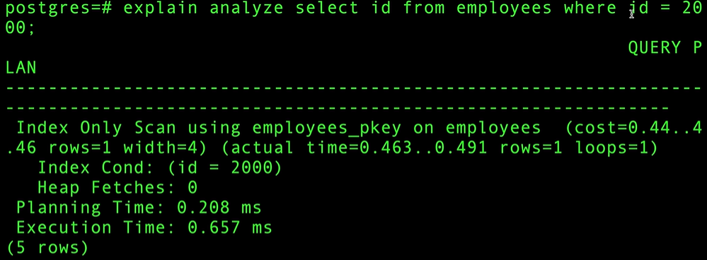

# 데이터베이스 인덱싱

# 25.04.24

백만 개의 행이 있는 Postgres 테이블 만들기

- `create table temp(t int)`
- `insert into temp(t) select random() * 100 from generate_series(0, 1000000)`

---

# 25.04.28

인덱스(Index)

- 기존 테이블 위에 구축하고 할당하는 데이터 구조로, 테이블을 조회하고 분석하여 요약한 일종의 지름길
    - B-트리와 LSM트리로 2가지 유형

- id는 인덱스이므로 id를 조회할 때에는 찾는 속도가 매우 빠름 ⇒ heap(실제 데이터가 있는 곳)에서 찾을 필요가 없기 때문

- name이라는 필드는 인덱스에 없기 때문에 heap에서 실제 데이터를 찾는 과정이 필요

- name을 조회하는 쿼리를 한 번 더 수행하면 속도가 더 빨라진 것을 볼 수 있는데, 이는 캐싱을 하기 때문

- where절에서 name은 인덱스에 없고, 실제 이름 값 Zs를 찾기 위해 직원  테이블을 하나씩 하나씩 순차적으로 스캔

- name 필드에 대한 인덱스 생성

- name 필드에 대한 인덱스를 생성한 후, 다시 쿼리를 실행해보면 속도가 더 빨라진 것을 확인할 수 있음

- where절에서 정확한 값이 아닌 like를 사용한 표현식으로 바꿔서 수행

- name 필드는 인덱스가 있지만 정확한 값이 아닌 표현식으로 요청했기 때문에 모든 데이터를 순차적으로 스캔하여 시간이 오래 걸림

Explain으로 SQL 쿼리 플래너와 옵티마이저 이해하기

- 아래와 같은 테이블과 인덱스가 있다고 가정

| Column | Type | Collation | Nullable | Default |
| --- | --- | --- | --- | --- |
| id | integer |  | not null | nextval(’grades_id_seq’::regclass) |
| g | double precision |  |  |  |
| name | text |  |  |  |
- Indexes:
    - “g_idx” btree (g)
    - “id_idx” btree(id)

- explain select * from grades;
    - 결과
        - Seq Scan on grades (cost=0.00..289025.15 rows=121412125 width=31) (1 row)
    - 결과 분석
        - Seq Scan: 순차 스캔 ⇒ 다른 DB에서는 전체 테이블 스캔과 동등
        - cost에서 첫 번째 숫자는 첫 번째 페이지를 가져오는데 드는 비용, 두 번째 숫자는 데이터베이스가 미리 예상하는 총 비용
        - width: 모든 열의 바이트 합계

- explain select * from grades order by g;
    - 결과
        - Index Scan using g_idx on grades (cost=0.43..1257856.88 rows=12141215 width=31) (1 row)
    - 결과 분석
        - cost를 보면, 첫 번째 페이지를 가져오는데 0.43만큼의 비용이 소요됨 ⇒ g는 인덱스가 있기 때문에 g를 기준으로 정렬하는 것은 매우 사소한 작업임

- explain select * from grades order by name;
    - 결과
        - Gather Merge (cost=1024586.74..2205065.16 rows=10117680 width=31)
        - Workers Planned: 2
        - → Sort (cost=1023586.72..1036233.82 rows=5058840 width=31)
        - Sort Key: name
        - → Parallel Seq Scan on grades (cost=0.00..218201.40 rows=5058840 width=31) (5rows)
    - 결과 분석
        - grades테이블을 순차 스캔, 5058840개의 행을 반환, 행의 평균 너비 31
        - 5058840개의 행을 이름 기준으로 정렬
        - 2개의 워커가 일함
        - 2개의 워커가 병렬로 스캔한 데이터를 유지하면서 병합(merge)

- explain select id from grades;
    - 결과
        - Seq Scan on grades (cost=0.00..289025.15 rows=12141215 width=4)
        - JIT:
        - Functions: 2
        - Options: Inlining false, Optimization false, Expressions true, Deforming true (4 rows)
    - 결과 분석
        - grades 테이블을 순차 스캔, 12141215개의 행 반환, 행의 평균 너비 = 4
        - JIT 컴파일 사용
        - Functions: 2 ⇒ JIT 컴파일 된 함수는 2개
        - Inlining ⇒ JIT(Just-In-Time) 컴파일러가 함수 호출을 최적화하여 성능을 개선, JIT 컴파일은 작은 함수의 본문을 해당 함수를 사용하는 표현식에 인라인으로 삽입
        - Optimization ⇒ LLVM은 생성된 코드 최적화를 지원. 일부 최적화는 JIT을 사용할 때마다 수행할 수 있을 만큼 비용이 저렴하지만, 다른 최적화는 장기 실행 쿼리에만 효과적
            - LLVM: 모듈화되고 재사용 가능한 컴파일러와 툴체인 기술의 집합체
        - Expressions ⇒ SQL 표현식에 대해 JIT 적용
        - Deforming ⇒ 테이블의 Row를 튜플 구조로 해석할 때 JIT을 사용

- explain select name from grades;
    - 결과
        - Seq Scan on grades (cost=0.00..289025.15 rows=12141215 width=19)
        - JIT:
        - Functions: 2
        - Options: Inlining false, Optimization false, Expressions true, Deforming true (4 rows)
    - 결과 분석
        - 행의 평균 너비 19

- explain select g from grades;
    - 결과
        - Seq Scan on grades (cost=0.00..289025.15 rows=12141215 width=8)
        - JIT:
        - Functions: 2
        - Options: Inlining false, Optimization false, Expressions true, Deforming true (4 rows)
    - 결과 분석
        - 행의 평균 너비 8

- explain select * from grades where id = 10;
    - 결과
        - Index Scan using id_idx on grades (cost=0.43..8.45 rows=1 width=31)
        - Index Cond: (id = 10) (2 rows)
    - 결과 분석
        - where절에서 id는 인덱스가 있으므로 실행 비용이 매우 낮음

- explain select id from grades where id = 10;
    - 결과
        - Index Only Scan using id_idx on grades (cost=0.43..4.45 rows=1 width=4)
        - Index Cond: (id = 10) (2 rows)
    - 결과 분석
        - where절에서 id는 인덱스가 있고, 조회할 데이터도 id이므로 인덱스에서만 찾아도 되므로 위의 쿼리보다 실행 비용은 더 낮음

비트맵 인덱스 스캔 vs 인덱스 스캔 vs 테이블 스캔

| Column | Type | Collation | Nullable | Default |
| --- | --- | --- | --- | --- |
| id | integer |  | not null | nextval(’grades_id_seq’::regclass) |
| name | text |  |  |  |
| g | double |  |  |  |
| firstname | text |  |  |  |
| lastname | text |  |  |  |
| address | text |  |  |  |
| bio | text |  |  |  |
- Indexes:
    - “grades_pkey” PRIMARY KEY, btree (id)
    - “g” btree (g) INCLUDE (id)

- explain select name from grades where
    - 결과
        - Index Scan using grades_pkey on grades (cost=0.43..8.45 rows=1 width=4)
        - Index Cond: (id = 1000) (2 rows)

- explain select name from grades where id < 100;
    - 결과
        - Index Scan using grades_pkey on grades (cost=0.43..391.13 rows=98 width=4)
        - Index Cond: (id < 100) (2 rows)

- explain select name from grades where id > 100;
    - 결과
        - Seq Scan on grades (cost=0.00..134265.34 rows=5000248 width=4)
        - Filter: (id > 100)
        - JIT:
        - Functions: 4
        - Options: Inlining false, Optimization false, Expressions true, Deforming true (5 rows)

- explain select name from grades where g > 95;
    - 결과
        - Bitmap Heap Scan on grades (cost=3859.77..110758.53 rows=205850 width=4)
        - Recheck Cond: (g > 95)
        - → Bitmap Index Scan on g (cost=0.00..3808.31 rows=205850 width=0)
        - Index Cond: (g > 95)
        - JIT:
        - Functions: 4
        - Options: Inlining false, Optimization false, Expressions true, Deforming true (7 rows)
    - 결과 분석
        - Bitmap Index Scan ⇒ 인덱스를 스캔하여 어떤 페이지에 찾고자 하는 행이 있는지 확인하여 bitmap을 생성
        - bitmap을 만드는 과정에서 탐색할 페이지를 확인했어도, 그 중 일부는 조건을 만족하지 못할 수 있음(각 페이지에는 한 줄의 데이터만 있는 것이 아니므로…) ⇒ 조건을 다시 확인하여 불필요한 데이터 제거

- explain select name from grades where g > 95 and id < 10000;
    - 결과
        - Bitmap Heap Scan on grades (cost=3988.96..5497.62 rows=394 width=4)
        - Recheck Cond: ((id < 10000) and (g > 95))
        - → BitmapAnd (cost=3988.96..3988.96 rows=394 width=0)
        - → Bitmap Index Scan on grades_pkey (cost=0.00..180.21 rows=9570 width=0)
        - Index Cond: (id < 10000)
        - → Bitmap Index Scan on g (cost=0.00..3808.31 rows=205850 width=0)
        - Index Cond: (g > 95) (7 rows)
    - 결과 분석
        - Bitmap Index Scan ⇒ 인덱스를 스캔하여 어떤 페이지에 찾고자 하는 행이 있는지 확인하여 bitmap을 생성
            - 조건이 2개이고, 각 조건에 쓰인 필드는 각각의 인덱스를 가지고 있음 ⇒ 2개의 필드에 대해서 Bitmap Index Scan을 진행 후, 서로 겹치는 페이지가 있는 것만 방문하도록 함
        - bitmap을 만드는 과정에서 탐색할 페이지를 확인했어도, 그 중 일부는 조건을 만족하지 못할 수 있음(각 페이지에는 한 줄의 데이터만 있는 것이 아니므로…) ⇒ 조건을 다시 확인하여 불필요한 데이터 제거

---

# 25.04.29

식별자 인덱스 vs 비 식별자 인덱스

| Column | Type | Collation | Nullable | Default |
| --- | --- | --- | --- | --- |
| id | integer |  | not null | nextval(’students_id_seq’::regclass) |
| g | integer |  |  |  |
| firstname | text |  |  |  |
| lastname | text |  |  |  |
| middlename | text |  |  |  |
| address | text |  |  |  |
| bio | text |  |  |  |
| dob | date |  |  |  |
| id1 | integer |  |  |  |
| id2 | integer |  |  |  |
| id3 | integer |  |  |  |
| id4 | integer |  |  |  |
| id5 | integer |  |  |  |
| id6 | integer |  |  |  |
| id7 | integer |  |  |  |
| id8 | integer |  |  |  |
| id9 | integer |  |  |  |
- Indexes:
    - “students_pkey” PRIMARY KEY, btree (id)

- select count(*) from students;
    - 결과
        - 50000001 (1 row)

- explain analyze select id, g from students where g > 80 and g < 95 order by g desc;
    - 결과
        - Gather Merge (cost=1640158.65..2284548.04 rows=5522952 width=8) (actual time=18064.012..21558.054 rows=6998081 loops=1)
        - Workers Planned: 2
        - Workers Launched: 2
        - → Sort (cost=1639158.62..1646062.31 rows=2761476 width=8) (actual time=17992.638..18400.784 rows=2332694 loops=3)
        - Sort Key: g DESC
        - Sort Method: external merge Disk: 41728kB
        - Worker 0: Sort Method: external merge Disk: 39096kB
        - Worker 1: Sort Method: external merge Disk: 42552kB
        - → Parallel Seq Scan on students (cost=0.00..1268206.00 rows=2761476 width=8) (actual time=6415.093..17112.065 rows=2332694 loops=3)
        - Filter: ((g > 80) AND (g < 95))
        - Rows Removed by Filter: 14333973
        - Planning Time: 0.218 ms
        - JIT:
        - Functions: 12
        - Options: Inlining true, Optimization true, Expressions true, Deforming true
        - Timing: Generation 5.795 ms, Inlining 134.608 ms, Optimization 86.922 ms, Emission 39.185 ms, Total 266.510 ms
        - Execution Time: 21933.784 ms (17 rows)

- explain analyze select id, g from students where g > 80 and g < 95 order by g desc limit 1000;
    - 결과
        - Limit (cost=1420614.77..1420731.45 rows=1000 width=8) (actual time=17184.391..17199.195 rows=1000 loops=1)
        - → Gather Merge (cost=1420614.77..2065004.16 rows=5522952 width=8) (actual time=17145.598..17160.234 rows=1000 loops=1)
        - Workers Planned: 2
        - Workers Launched: 2
        - → Sort (cost=1419614.75..1426518.44 rows=2761476 width=8) (actual time=17097.798..17097.956 rows=1000 loops=3)
        - Sort Key: g DESC
        - Sort Method: top-N heapsort Memory: 95kB
        - Worker 0: Sort Method: top-N heapsort Memory: 95kB
        - Worker 1: Sort Method: top-N heapsort Memory: 95kB
        - → Parallel Seq Scan on students (cost=0.00..1268206.00 rows=2761476 width=8) (actual time=6339.531..16762.004 rows=2332694 loops=3)
        - Filter: ((g > 80) AND (g < 95))
        - Rows Removed by Filter: 14333973
        - Planning Time: 1.113 ms
        - JIT:
        - Functions: 13
        - Options: Inlining true, Optimization true, Expressions true, Deforming true
        - Timing: Generation 2.616 ms, Inlining 162.776 ms, Optimization 112.842 ms, Emission 42.770 ms, Total 321.005 ms
        - Execution Time: 17199.935 ms (18 rows)

- create index g_idx on students(g);
    - 성적에 대한 인덱스 생성

- explain analyze select id, g from students where g > 80 and g < 95 order by g desc;
    - 결과
        - Index Scan Backward using g_idx on students (cost=0.56..1099655.72 rows=6627542 width=8) (actual time=42.615..15824.955 rows=6998081 loops=1)
        - Index Cond: ((g > 80) AND (g < 95))
        - Planning Time: 2.408 ms
        - JIT:
        - Functions: 4
        - Options: Inlining true, Optimization true, Expressions true, Deforming true
        - Timing: Generation 0.844 ms, Inlining 2.471 ms, Optimization 24.615 ms, Emission 11.961 ms, Total 39.890 ms
        - Execution Time: 16167.889 ms (8 rows)

- explain analyze select id, g from students where g > 80 and g < 95 order by g desc limit 1000;
    - 결과
        - Limit (cost=0.56..166.49 rows=1000 width=8) (actual time=0.035..0.395 rows=1000 loops=1)
        - → Index Scan Backward using g_idx on students (cost=0.56..1099655.72 rows=6627542 width=8) (actual time=0.033..0.305 rows=1000 loops=1)
        - Index Cond: ((g > 80) AND (g < 95))
        - Planning Time: 2.715 ms
        - Execution Time: 0.455 ms (5 rows)

- explain (analyze, buffers) select id, g from students where g > 10 and g < 20 order by g desc limit 1000;
    - 결과
        - Limit (cost=0.56..170.33 rows=1000 width=8) (actual time=2.904..6.052 rows=1000 loops=1)
        - Buffers: shared hit=10 read=24
        - → Index Scan Backward using g_idx on students (cost=0.56..714966.62 rows=4211417 width=8) (actual time=2.903..5.948 rows=1000 loops=1)
        - Index Cond: ((g > 10) AND (g < 20))
        - Buffers: shared hit=10 read=24
        - Planning:
        - Buffers: shared hit=20
        - Planning Time: 0.164 ms
        - Execution Time: 6.126 ms (9 rows)

- explain (analyze, buffers) select id, g from students where g > 10 and g < 20 order by g desc limit 10000;
    - 결과
        - Limit (cost=0.56..1698.25 rows=10000 width=8) (actual time=0.024..24.829 rows=10000 loops=1)
        - Buffers: shared hit=106 read=180
        - → Index Scan Backward using g_idx on students (cost=0.56..714966.62 rows=4211417 width=8) (actual time=0.023..23.750 rows=10000 loops=1)
        - Index Cond: ((g > 10) AND (g < 20))
        - Buffers: shared hit=106 read=180
        - Planning:
        - Buffers: shared hit=20
        - Planning Time: 0.184 ms
        - Execution Time: 25.406 ms (9 rows)

- explain (analyze, buffers) select id, g from students where g > 10 and g < 20 order by g desc;
    - 결과
        - Index Scan Backward using g_idx on students (cost=0.56..714966.62 rows=4211417 width=8) (actual time=59.056..11218.469 rows=4499699 loops=1)
        - Index Cond: ((g > 10) AND (g < 20))
        - Buffers: shared hit=37462 read=89599
        - Planning:
        - Buffers: shared hit=20
        - Planning Time: 0.376 ms
        - JIT:
        - Functions: 4
        - Options: Inlining true, Optimization true, Expressions true, Deforming true
        - Timing: Generation 0.510 ms, Inlining 2.331 ms, Optimization 42.051 ms, Emission 14.494 ms, Total 59.386 ms
        - Execution Time: 11481.740 ms (11 rows)

- drop index g_idx;
    - 성적 인덱스 삭제

- create index g_idx on students(g) include (id);
    - 성적 인덱스에 id도 같이 포함

- explain (analyze, buffers) select id, g from students where g > 10 and g < 20 order by g desc;
    - 결과
        - Index Only Scan Backward using g_idx on students (cost=0.56..130484.690 rows=4211417 width=8) (actual time=50.636..3736.904 rows=4499699 loops=1)
        - Index Cond: ((g > 10) AND (g < 20))
        - Heap Fetches: 0
        - Buffers: shared hit=4 read=12297
        - Planning:
        - Buffers: shared hit=32 read=8 dirtied=3
        - Planning Time: 4.844 ms
        - JIT:
        - Functions: 2
        - Options: Inlining false, Optimization false, Expressions true, Deforming true
        - Timing: Generation 11.779 ms, Inlining 0.000 ms, Optimization 6.936 ms, Emission 41.301 ms, Total 60.016 ms
        - Execution Time: 3997.406 ms (12 rows)

- explain (analyze, buffers) select id, g from students where g > 10 and g < 20 order by g desc;
    - 결과
        - Index Only Scan Backward using g_idx on students (cost=0.56..130484.690 rows=4211417 width=8) (actual time=2.122..791.036 rows=4499699 loops=1)
        - Index Cond: ((g > 10) AND (g < 20))
        - Heap Fetches: 0
        - Buffers: shared hit=11699 read=602
        - Planning:
        - Buffers: shared hit=20
        - Planning Time: 0.498 ms
        - JIT:
        - Functions: 2
        - Options: Inlining false, Optimization false, Expressions true, Deforming true
        - Timing: Generation 0.360 ms, Inlining 0.000 ms, Optimization 0.197 ms, Emission 1.739 ms, Total 2.296 ms
        - Execution Time: 1040.545 ms (12 rows)

- vacuum (verbose) students;
    - 결과
        - launched 1 parallel vacuum worker for index cleanup (planned: 1)
        - INFO: index “g_idx” now contains 50000001 row versions in 137292 pages
        - DETAIL: 0 index row versions were removed.
        - 0 index pages have been deleted, 0 are currently reusable.
        - CPU: user 0.17 s, system: 0.60 s, elapsed: 1.04 s.
        - INFO: “students”: found 0 removable, 50 nonremovable row versions in 1 out of 955706 pages
        - DETAIL: 0 dead row versions cannot be removed yet, oldest xmin: 732
        - There were 0 unused item identifieres.
        - Skipped 0 pages due to buffer pins, 955705 frozen pages.
        - 0 pages are entirely empty.
        - CPU: user: 0.18 s, system: 0.67 s, elapsed: 1.13 s.
        - INFO: vacuuming “pg_toast.pg_toast_16386”
        - INFO: index “pg_toast_16386_index” now contains 0 row versions in 1 pages
        - DETAIL: 0 index row versions were removed.

---

# 25.05.02

Index Scan vs Index Only Scan

- \d grades;
    
    
    | Column | Type | Collation | Nullable | Default |
    | --- | --- | --- | --- | --- |
    | id | integer |  |  |  |
    | g | integer |  |  |  |
    | name | character varying(200) |  |  |  |
    - \d: postgres의 메타 명령어. 특정 테이블, 뷰, 시퀀스 등의 정보 확인

- explain analyze select name from grades where id = 7;
    - 결과
        - Gather (cost=1000.00..107139.33 rows=1 width=5) (actual time=401.883..412.012 rows=1 loops=1)
        - Workers Planned: 2
        - Workers Launched: 2
        - → Parallel Seq Scan on grades (cost=0.00..106139.23 rows=1 width=5) (actual time=366.348..366.372 rows=0 loops=3)
        - Filter: (id = 7)
        - Rows Removed by Filter: 3333333
        - Planning Time: 0.090 ms
        - JIT:
        - Functions: 12
        - Options: Inlining false, Optimization false, Expressions true, Deforming true
        - Timing: Generation 2.591 ms, Inlining 0.000 ms, Optimization 0.996 ms, Emission 12.480 ms, Total 16.068 ms
        - Execution Time: 413.231 ms (12 rows)

- create index id_idx on grades(id);
    - id에 대한 인덱스 생성

- explain analyze select name from grades where id = 7;
    - 결과
        - Index Scan using id_idx on grades (cost=0.43..8.45 rows=1 width=5) (actual time=1.005..1.029 rows=1 loops=1)
        - Index Cond: (id = 7)
        - Planning Time: 0.354 ms
        - Execution Time: 1.123 ms (4 rows)

- explain analyze select id from grades where id = 7;
    - 결과
        - Index Only Scan using id_idx on grades (cost=0.43..8.45 rows=1 width=4) (actual time=0.076..0.098 rows=1 loops=1)
        - Index Cond: (id = 7)
        - Heap Fetches: 1
        - Planning Time: 0.153 ms
        - Execution Time: 0.182 ms (5 rows)

- drop index id_idx;
    - id에 걸린 인덱스 제거

- create index id_idx on grades(id) include (name);
    - id 인덱스에 name도 포함

- explain analyze select name from grades where id = 7;
    - 결과
        - Index Only Scan using id_idx on grades (cost=0.43..8.45 rows=1 width=5) (actual time=6.951..6.974 rows=1 loops=1)
        - Index Cond: (id = 7)
        - Heap Fetches: 1
        - Planning Time: 0.455 ms
        - Execution Time: 7.058 ms (5 rows)

- explain analyze select g from grades where id = 7;
    - 결과
        - Index Scan using id_idx on grades (cost=0.43..8.45 rows=1 width=4) (actual time=0.098..0.125 rows=1 loops=1)
        - Index Cond: (id = 7)
        - Planning Time: 0.296 ms
        - Execution Time: 0.250 ms (4 rows)

성능 개선을 위한 데이터베이스 인덱스 결합

- \d test;
    
    
    | Column | Type | Collation | Nullable | Default |
    | --- | --- | --- | --- | --- |
    | a | integer |  |  |  |
    | b | integer |  |  |  |
    | c | integer |  |  |  |
- create index on test(a);
    - a에 인덱스 생성

- create index on test(b);
    - b에 인덱스 생성

- \d test;
    
    
    | Column | Type | Collation | Nullable | Default |
    | --- | --- | --- | --- | --- |
    | a | integer |  |  |  |
    | b | integer |  |  |  |
    | c | integer |  |  |  |
    - Indexes:
        - “test_a_idx” btree (a)
        - “test_b_idx” btree (b)

- explain analyze select c from test where a = 70;
    - 결과
        - Bitmap Heap Scan on test (cost=113.21..26654.22 rows=9907 width=4) (actual time=4.949..162.880 rows=9898 loops=1)
        - Recheck Cond: (a = 70)
        - Heap Blocks: exact=9059
        - → Bitmap Index Scan on test_a_idx (cost=0.00..110.74 rows=9907 width=0) (actual time=3.131..3.139 rows=9898 loops=1)
        - Index Cond: (a = 70)
        - Planning Time: 0.951 ms
        - Execution Time: 253.374 ms (7 rows)

- explain analyze select c from test where a = 70 limit 2;
    - 결과
        - Limit (cost=0.43..6.65 rows=2 width=4) (actual time=0.060..0.134 rows2 loops=1)
        - → Index Scan using test_a_idx on test (cost=0.43..30800.03 rows=9907 width=4) (actual time=0.039..0.063 rows=2 loops=1)
        - Index Cond: (a = 70)
        - Planning Time: 0.113 ms
        - Execution Time: 0.215 ms (5 rows)

- explain analyze select c from test where b=100;
    - 결과
        - Bitmap Heap Scan on test (cost=113.56..26742.64 rows=9952 width=4) (actual time=3.262..157.991 rows=10000 loops=1)
        - Recheck Cond: (b = 100)
        - Heap Blocks: exact=9140
        - → Bitmap Index Scan on test_b_idx (cost=0.00..111.08 rows=9952 width=0) (actual time=1.406..1.414 rows=10000 loops=1)
        - Index Cond: (b = 100)
        - Planning Time: 0.092 ms
        - Execution Time: 250.723 ms (7 rows)

- explain analyze select c from test where a = 100 and b = 200;
    - 결과
        - Bitmap Heap Scan on test (cost=222.07..253.92 rows=8 width=4) (actual time=3.884..4.054 rows=6 loops=1)
        - Recheck Cond: ((a = 100) AND (b= 200))
        - Heap Blocks: exact=6
        - → BitmapAnd (cost=222.07..222.07 rows=8 width=0) (actual time=3.811..3.855 rows=0 loops=1)
        - → Bitmap Index Scan on test_a_idx (cost=0.00..110.74 rows=9907 width=0) (actual time=1.778..1.786 rows=9978 loops=1)
        - Index Cond: (a = 100)
        - → Bitmap Index Scan on test_b_idx (cost=0.00..111.08 rows=9952 width=0) (actual time=1.425..1.434 rows=10088 loops=1)
        - Index Cond: (b = 200)
        - Planning Time: 0.167 ms
        - Execution Time: 4.181 ms (10 rows)

- explain analyze select c from test where a = 100 or b = 200;
    - 결과
        - Bitmap Heap Scan on test (cost=231.74..42798.95 rows=19851 width=4) (actual time=5.563..307.007 rows=20060 loops=1)
        - Recheck Cond: ((a = 100) OR (b= 200))
        - Heap Blocks: exact=16788
        - → BitmapOr (cost=231.74..231.74 rows=19860 width=0) (actual time=2.848..2.887 rows=0 loops=1)
        - → Bitmap Index Scan on test_a_idx (cost=0.00..110.74 rows=9907 width=0) (actual time=1.484..1.491 rows=9978 loops=1)
        - Index Cond: (a = 100)
        - → Bitmap Index Scan on test_b_idx (cost=0.00..111.08 rows=9952 width=0) (actual time=1.319..1.326 rows=10088 loops=1)
        - Index Cond: (b = 200)
        - Planning Time: 0.131 ms
        - Execution Time: 488.123 ms (10 rows)

- drop index test_a_idx, test_b_idx;
    - a에 걸린 인덱스와 b에 걸린 인덱스 모두 삭제

- create index on test (a,b);
    - 하나의 인덱스에 2개의 필드를 포함한 복합 인덱스 생성

- explain analyze select c from test where a = 70;
    - 결과
        - Bitmap Heap Scan on test (cost=121.21..26662.22 rows=9907 width=4) (actual time=4.265..162.752 rows=9898 loops=1)
        - Recheck Cond: (a = 70)
        - Heap Blocks: exact=9059
        - → Bitmap Index Scan on test_a_b_idx (cost=0.00..118.74 rows=9907 width=0) (actual time=2.668..2.676 rows=9898 loops=1)
        - Index Cond: (a = 70)
        - Planning Time: 0.855 ms
        - Execution Time: 253.988 ms (7 rows)

- explain analyze select c from test where a = 70 limit 10;
    - 결과
        - Limit (cost=0.43..34.28 rows=10 width=4) (actual time=0.084..0.495 rows=10 loops=1)
        - → Index Scan using test_a_b_idx on test (cost=0.43..33533.56 rows=9907 width=4) (actual time=0.062..0.221 rows=10 loops=1)
        - Index Cond: (a = 70)
        - Planning Time: 0.124 ms
        - Execution Time: 0.824 ms (5 rows)

- explain analyze select c from test where b = 100;
    - 결과
        - Gather (cost=1000.00..129360.20 rows=9952 width=4) (actual time=111.175..482.030 rows=10000 loops=1)
        - Workers Planned: 2
        - Workers Launched: 2
        - → Parallel Seq Scan on test (cost=0.00..127365.00 rows=4147 width=4) (actual time=72.908..431.270 rows=3333 loops=3)
        - Filter: (b = 100)
        - Rows Removed by Filter: 3996667
        - Planning Time: 0.285 ms
        - JIT:
        - Functions: 12
        - Options: Inlining false, Optimization false, Expressions true, Deforming true
        - Timing: Generation 11.547 ms, Inlining 0.000 ms, Optimization 1.709 ms, Emission 11.699 ms, Total 24.955 ms
        - Execution Time: 572.528 ms (12 rows)

- explain analyze select c from test where a = 70 and b = 80;
    - 결과
        - Index Scan using test_a_b_idx on test (cost=0.43..33.93 rows=8 width=4) (actual time=0.055..0.264 rows=14 loops=1)
        - Index Cond: ((a = 70) AND (b = 80))
        - Planning Time: 0.545 ms
        - Execution time: 0.488 ms (4 rows)

- explain analyze select c from test where a = 70 or b = 80;
    - 결과
        - Gather (cost=1000.00..142850.10 rows=19851 width=4) (actual time=127.111..583.573 rows=19711 loops=1)
        - Workers Planned: 2
        - Workers Launched: 2
        - → Parallel Seq Scan on test (cost=0.00..139865.00 rows=8271 width=4) (actual time=93.055..534.277 rows=6570 loops=3)
        - Filter: ((a = 70) OR (b = 80))
        - Rows Removed by Filter: 3993430
        - Planning Time: 0.103 ms
        - JIT:
        - Functions: 12
        - Options: Inlining false, Optimization false, Expressions true, Deforming true
        - Timing: Generation 1.851 ms, Inlining 0.000 ms, Optimization 1.051 ms, Emission 16.323 ms, Total 19.225 ms
        - Execution Time: 758.292 ms (12 rows)

- explain analyze select c from test where a = 70 or b = 80 limit 1;
    - 결과
        - Limit (cost=0.00..12.34 rows=1 width=4) (actual time=202.559..202.590 rows=1 loops=1)
        - → Seq Scan on test (cost=0.00..244865.00 rows=19851 width=4) (actual time=202.539..202.547 rows=1 loops=1)
        - Filter: ((a = 70) OR (b = 80))
        - Rows Removed by Filter: 1947231
        - Planning Time: 0.102 ms
        - Execution Time: 202.725 ms (6 rows)

- \d test;
    
    
    | Column | Type | Collation | Nullable | Default |
    | --- | --- | --- | --- | --- |
    | a | integer |  |  |  |
    | b | integer |  |  |  |
    | c | integer |  |  |  |
    - Indexes:
        - “test_a_b_idx” btree (a, b)

- create index on test(b);

- explain analyze select c from test where a = 70;
    - 결과
        - Bitmap Heap Scan on test (cost=121.21..26662.22 rows=9907 width=4) (actual time=3.522..119.637 rows=9898 loops=1)
        - Recheck Cond: (a = 70)
        - Heap Blocks: exact=9059
        - → Bitmap Index Scan on test_a_b_idx (cost=0.00..118.74 rows=9907 width=0) (actual time=2.041..2.049 rows=9898 loops=1)
        - Index Cond: (a = 70)
        - Planning Time: 0.965 ms
        - Execution Time: 208.646 ms (7 rows)

- explain analyze select c from test where b = 70;
    - 결과
        - Bitmap Heap Scan on test (cost=113.56..26742.64 rows=9952 width=4) (actual time=3.084..160.325 rows=9961 loops=1)
        - Recheck Cond: (b = 70)
        - Heap Blocks: exact=9105
        - → Bitmap Index Scan on test_b_idx (cost=0.00..111.08 rows=9952 width=0) (actual time=1.655..1.664 rows=9961 loops=1)
        - Index Cond: (b = 70)
        - Planning Time: 0.117 ms
        - Execution Time: 253.004 ms (7 rows)

- explain analyze select c from test where a = 70 or b = 80;
    - 결과
        - Bitmap Heap Scan on test (cost=239.74..42806.95 rows=19851 width=4) (actual time=6.589..300.934 rows=19711 loops=1)
        - Recheck Cond: ((a = 70) OR (b = 80))
        - Heap Blocks: exact=16520
        - → BitmapOr (cost=239.74..239.74 rows=19860 width=0) (actual time=3.894..3.932 rows=0 loops=1)
        - → Bitmap Index Scan on test_a_idx (cost=0.00..118.74 rows=9907 width=0) (actual time=2.199..2.207 rows=9898 loops=1)
        - Index Cond: (a = 70)
        - → Bitmap Index Scan on test_b_idx (cost=0.00..111.08 rows=9952 width=0) (actual time=1.665..1.673 rows=9827 loops=1)
        - Index Cond: (b = 80)
        - Planning Time: 0.100 ms
        - Execution Time: 479.301 ms (10 rows)
